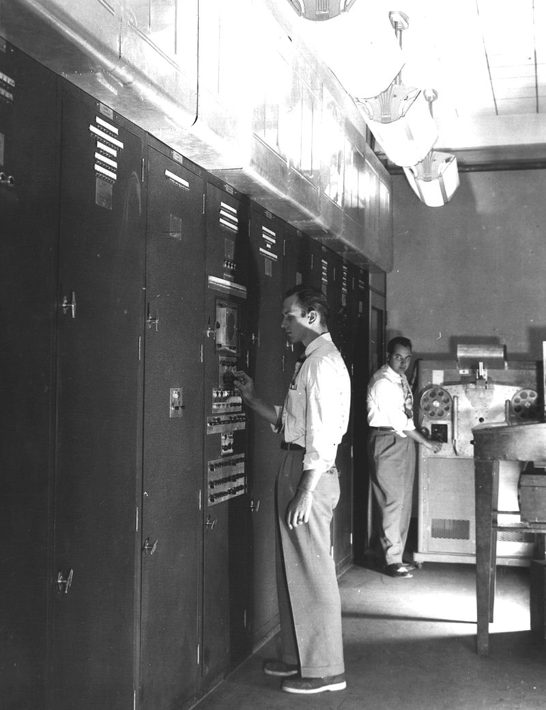

# コンピュータの歴史

コンピュータの歴史からプログラミングの概要に触れます。

## 1. 数値計算

もともとは高速な計算をする目的で開発されました。

↓昔のクソでかコンピュータ。メモリはわずかしかない。

* Colossus(コロッサス) - **暗号解読**. 1944年

* ENIAC(エニアック) - **弾道計算**・微分方程式. 1946年

* EDVAC(エドバック) - ENIACの進化版。弾道計算・微分方程式. 1951年

## 2. データの保存

コンピュータによる高速計算に欠かせないのは、一時的にデータを保存する「**メモリ**」という概念です。一時的にデータを保存すると一度計算した結果を再利用できるので効率的な計算が可能になります。上にあげたコンピュータもわずかながらメモリと言える仕組みがありました。

## 3. 数以外も扱う

昔のコンピュータは計算がメインでしたが、利便性を高めるため、文字、色などの数値以外もデータ化し、扱えるようになりました。

---

第2章では、単純な計算、値の保存、数値以外の値を体験します。

第3章では、上記のコンピュータの高速な計算を支えた仕組みであるプログラミングの肝(条件、繰り返し、サブルーチン)を体験します。